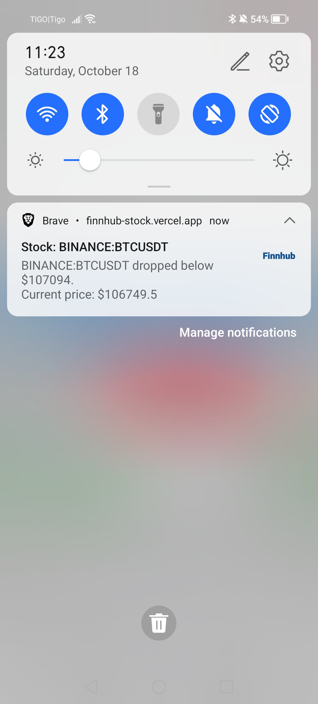

# Finnhub Stock Tracker

A real-time stock tracking dashboard built with **Next.js**, **React**, **TypeScript**, and **WebSockets**. This project allows users to monitor stock prices, set alerts, and receive push notifications when certain thresholds are met.

---

## 🌟 Demo

[](https://finnhub-stock.vercel.app/)

- 
- 
- 
- 

---

### Code Coverage

- **Testing framework**: [Jest](https://jestjs.io/) & [React Testing Library](https://testing-library.com/)

[](#)

---

## Table of Contents

- [Project Overview](#project-overview)
- [Installation](#installation)
- [Usage](#usage)
- [Project Structure](#project-structure)
- [Hooks](#hooks)
- [Context](#context)
- [Components](#components)
- [Utilities](#utilities)
- [Testing](#testing)
- [Technologies](#technologies)

---

## Project Overview

This project connects to Finnhub's WebSocket API to fetch real-time stock data. Users can:

- Add stocks to watch with alert prices.
- Receive notifications when a stock reaches its alert price.
- View interactive charts of historical stock data.
- Enable or disable live updates.

---

## Installation

1. Clone the repository:

```bash
git clone https://github.com/MWalter777/finnhub-stock
```

2. Install dependencies:

```bash
npm install
```

3. Create a `.env` file in the root and add your Finnhub API key:

```env
NEXT_PUBLIC_FINNHUB_API_KEY=your_api_key_here
```

4. Run the development server:

```bash
npm run dev
```

5. Build and start production:

```bash
npm run build
npm run start
```

---

## Usage

- Open the app in the browser.
- Add stocks to watch by selecting from the dropdown and setting an alert price.
- Enable live updates to receive real-time price data.
- Check interactive charts for each stock to see historical price trends.

---

## Project Structure

```
|-- sw-register.ts
|-- app
  |-- globals.css
  |-- layout.tsx
  |-- manifest.ts
  |-- page.tsx
|-- constant
  |-- finnhubUrls.ts
|-- hook
  |-- useOnlineStatus.tsx
  |-- useShowNotification.tsx
  |-- useStockSocket.tsx
|-- Store
  |-- StockProvider.tsx
|-- types
  |-- Stock.d.ts
  |-- StockProvider.d.ts
  |-- StockSocket.d.ts
  |-- UseStockSocket.d.ts
|-- utils
  |-- getStockSymbols.ts
  |-- graphUtils.ts
  |-- localStorageHandle.ts
  |-- notifications.ts
|-- tests
  |-- hook
    |-- useOnlineStatus.test.tsx
    |-- useShowNotification.test.tsx
    |-- useStockSocket.test.tsx
  |-- components
    |-- MainStocks.test.tsx
    |-- MultiGraphs.test.tsx
    |-- StockToWatchForm.test.tsx
    |-- TopCards.test.tsx
  |-- utils
    |-- getStockSymbols.test.ts
    |-- graphUtils.test.ts
    |-- localStorageHandle.test.ts
|-- components
  |-- Card
    |-- BodyCard.tsx
    |-- index.styled.ts
    |-- index.tsx
  |-- NavBar
    |-- index.tsx
  |-- MainStocks
    |-- index.styled.ts
    |-- index.tsx
  |-- StockToWatchForm
    |-- index.styled.ts
    |-- index.tsx
  |-- TopCards
    |-- index.styled.ts
    |-- index.tsx
  |-- GraphStocks
    |-- index.styled.ts
    |-- index.tsx
    |-- MultiGraphs.tsx
    |-- SingleGraph.tsx
```

---

## Hooks

### `useOnlineStatus`

- Monitors the browser's online/offline status.
- Returns a boolean `isOnline` to indicate connectivity.
- Useful for enabling/disabling WebSocket updates when offline.

### `useShowNotification`

- Handles push notifications in the browser.
- Requests notification permission if not already granted.
- Sends notifications when a stock reaches a user-defined alert price.

### `useStockSocket`

- Manages WebSocket connection with Finnhub API.
- Subscribes/unsubscribes to stock symbols for real-time updates.
- Maintains historical stock price data.
- Sends push notifications via `useShowNotification`.
- Can toggle the live WebSocket connection.

---

## Context

### `StockProvider`

- Provides global stock state using React Context.
- Tracks available stocks, stock history, and WebSocket connection state.
- Functions:
  - `addStockHistory(stock, alertPrice)`: Adds a stock to watch with alert price.
  - `removeStock(symbol)`: Removes a stock from tracking.
  - `toggleSocketConnection()`: Enables/disables live updates.
- Wrap your app with `<StockProvider>` to access stock data via `useStockContext`.

---

## Components

### `TopCards`

- Displays overview of watched stocks.
- Uses Swiper for horizontal scrolling.
- Includes button to enable/disable live updates.

### `StockToWatchForm`

- Form to add new stocks to watch.
- Uses Material UI `Autocomplete` and `TextField`.
- Validates alert price input.

### `MultiGraphs`

- Shows historical stock price charts.
- Uses Recharts `AreaChart`.
- Supports multiple stocks with color differentiation.
- Automatically updates with real-time data.

---

## Utilities

- `getStockSymbols.ts`: Fetches available stock symbols from API.
- `graphUtils.ts`: Handles chart data transformation and colors.
- `localStorageHandle.ts`: Saves and retrieves stock history from local storage.
- `notifications.ts`: Helper functions for push notifications.

---

## Testing

- Tests are written with **Jest** and **React Testing Library**.
- Run all tests:

```bash
npm run test
```

- Watch tests during development:

```bash
npm run test:watch
```

- Generate test coverage report:

```bash
npm run test:coverage
```

---

## Technologies

- [](https://nextjs.org/)
- [](https://reactjs.org/)
- [](https://www.typescriptlang.org/)
- [](https://mui.com/)
- [](https://recharts.org/)
- [](https://swiperjs.com/)
- [](https://tailwindcss.com/)
- [](https://jestjs.io/)
- [](https://testing-library.com/)

---

## Notes

1. Finnhub free plan allows **only 1 WebSocket connection per account**. Use the toggle button to manage live updates.
2. Supports offline mode by detecting network status.
3. Maximum of **7 stocks** can be tracked at a time.
4. **Alert system** allows setting a price threshold per stock.
5. **Notifications**: When a stock price goes below the alert level, a **browser push notification** is triggered.
   - ⚠️ These notifications are handled **entirely on the frontend** using the **Notification API** and the Service Worker (`postMessage`).
   - No backend server or external push service is required.
   - Finnhub does not provide push messages; all notifications are generated locally in the user’s browser.
